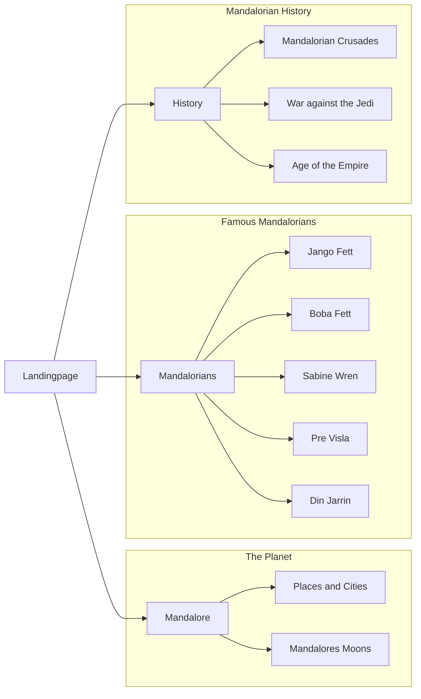

# Mandalore Wiki

## Contribute
- Write readable, correct and simple code (**K**eep **I**t **S**imple and **S**tupid)
- Comment incomprehensible code
- Comply with the Conventional Commit Messages [Standard](https://www.conventionalcommits.org/en/v1.0.0/) (in commits and pr's)
- Avoid merge commits

### Contribution flow:
1. think of a change
2. fork the repository
3. make changes
4. compare changes and make a pull request
5. await review and merge

## Start locally
